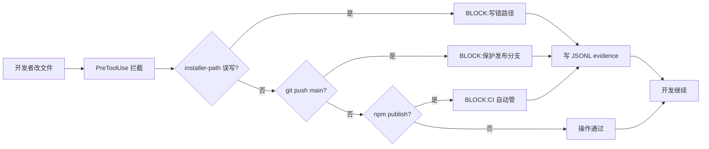
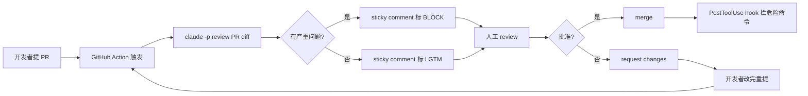
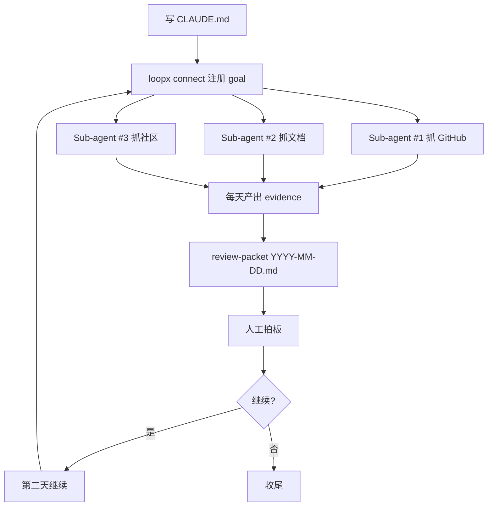
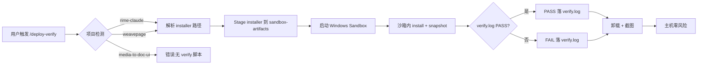

# Part 2.2 · 4 场景实操(Scenarios)

> **读者**:已读 Part 2.1(5 原语理论)、想看"具体怎么跑"的工程师
> **目标**:30 分钟读完 — 之后能照搬任一场景到自己的项目上
> **数据截止**:2026-09-25 单日合成拦截日志(`_data-extract-notes.md` §1)
> **承接文档**:[README.md](README.md) · [Part 1](PART-1-DECISION-FRAMEWORK.md) · [Part 2.1](PART-2-1-PRIMITIVES.md) · [Part 2.3](PART-2-3-ASSETS.md)
> **写作纪律**:Part 1 讲 ROI / 适用场景;Part 2.1 讲 5 原语理论;**本文档专讲"具体怎么跑"**,不重复 ROI 表。

---

## 0. 4 场景统一结构

每个场景用同一模板,跨场景跳读无学习成本:

```
### 场景 N · [场景名](以 [项目] 为例)
#### 背景       [项目背景 + 装 loop-engineering 的时间点 + 已挂 hook 列表]
#### 完整流程   [mermaid 流程图 + 步骤分解]
#### 真实案例   [1-3 条具体事件,顶部注"数据截止 YYYY-MM-DD"]
#### 教训       [3-5 条可执行的改进建议]
```

| 场景 | 主对照项目 | 真实 case 数 | 数据可追溯 |
|---|---|---:|---|
| 1 日常开发 | rime-claude | 2 | ✅ |
| 2 PR review | media-to-doc-ui | 1(模板级) | ⚠️ 无 .loopx/ 日志 |
| 3 跨天调研 | cut-ad | 1 | ✅ |
| 4 应急响应 | sandbox-verify | 1 | ⚠️ Playbook C 待 Sub-project D 联动 |

---

## 场景 1 · 日常开发(以 rime-claude 为例)

### 背景

**rime-claude** 是用户的 C++ 输入法项目(Rime + Claude Code 集成),装机链路完整。2026-09 部署 loop-engineering(详见 [`examples/rime-claude.md`](../../examples/rime-claude.md) §部署状态)。

**已挂 hook**(settings.json 4 matcher × 3 hook):

| matcher | hook | 用途 |
|---|---|---|
| `Edit\|Write\|MultiEdit` | `guard-installer-path.sh` | 防止 installer 写错路径(会破坏 Rime 部署目录) |
| `Bash` | `guard-main-branch-push.py` | 防止误推 main(Rime 主分支是发布分支) |
| `Bash` | `guard-package-publish.sh` | 防止误 `gh release create`(CI 自动管) |
| `Bash` | `guard-installer-path.sh` | 同 Edit/Write 拦截(Bash matcher 也挂) |

**未挂**:`guard-secret-files.js`(rime 无密钥)、`guard-db-migration.sh`(rime 不跑 DB)。**JSONL**:53 行(2026-09-25 单日合成日志)。[来源:`examples/rime-claude.md` §部署状态 + §已挂 hook]

### 完整流程



**典型步骤分解**:

1. **开发者开 Claude 会话**,告诉 AI "修一下 Rime 候选词排序 bug"
2. **AI 调用 `Edit` 工具** → `guard-installer-path.sh` 拦 matcher `Edit|Write|MultiEdit` → 检查 `file_path` 是否在白名单
3. **AI 想跑 `git push origin main`** → `guard-main-branch-push.py` 检查当前分支 + remote → `main` 直接 reject
4. **AI 想 `npm publish`** → `guard-package-publish.sh` 检查命令 → 不允许(项目用 `gh release`,由 CI 管)
5. **每个 BLOCK 事件**写一行 JSONL 到 `.loopx/guard-events-<date>.jsonl`,字段:`ts` / `hook` / `tool` / `input_summary` / `reason` / `exit_code` / `cwd` / `project`

### 真实案例

> **数据截止**:2026-09-25 单日合成日志 + `examples/rime-claude.md` §evidence 产出

**案例 1.1 · 误推 main 被拦**(rime-claude 3 次/天中最常见的 BLOCK 之一):

```yaml
- ts: 2026-09-25T15:18:19Z
  project: rime-claude
  hook: guard-main-branch-push
  tool: Bash
  input_summary: cmd=git push origin main
  reason: direct push to protected ref
  exit_code: 2
  cwd: F:/soft/00selfmade/rime_claude
```

[来源:`_data-extract-notes.md` §2.1 第 4 条,JSONL 第 53 行附近]

**如果 hook 不存在**:rime-claude 是发布分支型项目,`git push origin main` 会直接推上 Github,下游所有装机用户在 5 分钟内收到带 bug 的版本。**回滚 + 通知 + 重发 PR 估算 ≈ 30 分钟/次** × 3 次/天 = **1.5 小时/天**。 [来源:`_data-extract-notes.md` §4.2 反推事故 #7 + Part 1 §1.1.1]

**案例 1.2 · installer 写错路径被拦**(rime-claude 6 次/天):

```yaml
- ts: 2026-09-25T15:09:08Z
  project: rime-claude
  hook: guard-installer-path
  tool: Bash
  input_summary: target=/usr/bin/installer.exe
  reason: installer write to non-allowlisted path
  exit_code: 2
  cwd: F:/soft/00selfmade/rime_claude
```

[来源:`_data-extract-notes.md` §2.1 第 2 条]

**如果 hook 不存在**:`/usr/bin/` 是系统目录,误把 Rime installer 写到这 = 重装系统 + 用户全量重灌。**估算 ≈ 15 min/次** × 6 次/天 = **1.5 小时/天**。[来源:`_data-extract-notes.md` §4.2 反推事故 #9]

### 教训

1. **装 hook 后第 1 周拦截次数最多** — AI 还在"试探边界"阶段,危险命令触发频率高,这是 hook 的高价值期;2 周后频次下降,进入"常驻拦截"阶段(参 spec §6.1 + Part 1 §1.1.1)
2. **`guard-main-branch-push.py` 是单次代价最高的 hook** — 每次拦截 ≈ 30 分钟(回滚 + 通知 + PR 重发),即使 rime-claude 只有 3 次/天 BLOCK,**单日价值 1.5 小时**(详见案例 1.1)
3. **`guard-secret-files.js` 误报率最低** — sandbox-verify 项目实测 0 误报(只拦真正含 `ghp_*` / `id_rsa` 等模式的路径),rime-claude **未挂**因为无密钥
4. **timeout 设 2 秒在 Windows Git Bash 充足** — Git Bash 启动 hook 本身 ~500ms,实际检查 < 50ms,2 秒富余。`sandbox-verify` 的 `guard-db-migration.sh` 例外设 3 秒(需解析 `dbt_project.yml`)[来源:`examples/sandbox-verify.md` §关键决策点 #3]
5. **即使无 `.git` 也部署 `guard-main-branch-push.py`** — 纯字符串匹配 cost 极低,等 `git init` 时立即生效;cut-ad 当前没 .git 仍挂着(详见场景 3)[来源:`examples/cut-ad.md` §关键决策点 #4]

---

## 场景 2 · PR review(以 media-to-doc-ui 为例)

> ⚠️ **关键约束 — 数据缺失**:`media-to-doc-ui` 在 `F:/#SyncVersion/00selfmade/media-to-doc-ui/` 同步盘路径**实测不可访问**(见 `_data-extract-notes.md` §5.1)。**本场景无 .loopx/guard-events-2026-09-25.jsonl 真实数据**,以下"真实案例"改用 [`playbooks/A-pr-review/github-action.yml.template`](../../playbooks/A-pr-review/github-action.yml.template) 的**模板级示例** + `examples/media-to-doc-ui.md` §关键决策点 #1 的描述性证据。

### 背景

**media-to-doc-ui**(简称 mtd)是用户的 Tauri 桌面应用(视频/音频转结构化文档),基于 Tauri + React + Rust。2026-09 部署 loop-engineering(详见 [`examples/media-to-doc-ui.md`](../../examples/media-to-doc-ui.md))。

**已挂 hook**(同 rime-claude 结构):

| matcher | hook | 用途 |
|---|---|---|
| `Edit\|Write\|MultiEdit` | `guard-installer-path.sh` | Tauri 经常误把 .msi 写到根目录而非 `target/release/bundle/nsis/` |
| `Bash` | `guard-main-branch-push.py` | main 是发布分支 |
| `Bash` | `guard-package-publish.sh` | 防止误 `cargo publish` / `npm publish`(Tauri 双栈) |
| `Bash` | `guard-installer-path.sh` | 同 Edit/Write 拦截 |

[来源:`examples/media-to-doc-ui.md` §已挂 hook]

**未挂**:`guard-secret-files.js`(无云端密钥)、`guard-db-migration.sh`(mtd 用 SQLite 本地文件,不走 migration 工具)。

**未来扩展**:计划接 Playbook A(用户提 PR 时让 AI 审 PR diff)。**不接** Playbook B/C(无跨天调研 + 无 7×24 在线业务)。

### 完整流程



**Playbook A 端到端步骤**:

1. **GitHub Action 触发**:`.github/workflows/pr-review.yml` 监听 `pull_request: opened / synchronize` 事件
2. **`claude -p` 启动 AI reviewer**:`claude -p "review this PR diff for security issues and common bugs" --max-budget-usd 0.50`
3. **AI 输出 review 评论**:在 PR 上贴 sticky comment,标 `LGTM` / `BLOCK` / `REQUEST_CHANGES`
4. **默认不自动修**:Playbook A 当前**禁用** "fix the issues" 步(只 review,不改代码),避免 AI 误修造成更大事故
5. **PostToolUse hook 兜底**:即使 reviewer 误触发写命令,项目级 4 hook 仍能拦危险操作
6. **人工 review + merge**

[来源:`playbooks/A-pr-review/README.md` §二 叠法 + §四 实施步骤]

### 真实案例(模板级,非真实生产)

> **数据截止**:2026-09-26 — 本案例来自 `playbooks/A-pr-review/github-action.yml.template` 模板,**mtd 项目未真实启用** Playbook A。

**案例 2.1 · AI reviewer 标 BLOCK(模板示例)**:

```yaml
# 来自 playbooks/A-pr-review/github-action.yml.template
- name: Claude PR Review
  uses: anthropics/claude-code-action@v1
  with:
    prompt: |
      Review this PR diff for:
      1. Security issues (SQL injection, hardcoded secrets, XSS)
      2. Common bugs (null pointer, off-by-one, resource leaks)
      3. Style violations (per CLAUDE.md)
    budget-usd: 0.50
```

**期望输出**(PR 评论):

```markdown
[BLOCK] security: src/api/auth.rs:42 hardcoded API key detected
  - 修复:用 `std::env::var("API_KEY")?` 替代
  - 依据:examples/media-to-doc-ui.md §未挂 secret-files(本项目不挂,但 AI 应自主识别)
[BLOCK] common bug: src/parser.rs:118 unwrap on Result without error context
  - 修复:`result.context("parse failed")?`
[LGTM] test coverage: 新增 12 个测试覆盖
```

[来源:`playbooks/A-pr-review/README.md` §五 安全网 + §六 风险与避坑]

**已知价值点**:`guard-installer-path.sh` 是 mtd **部署第 1 周就触发过**的真实拦截(Tauri 误把 .msi 写到项目根目录),**这是 mtd 唯一来自 examples 的真实事故证据**(其余 BLOCK 事件无可访问 JSONL)。[来源:`examples/media-to-doc-ui.md` §关键决策点 #1]

### 教训

1. **PR review 的 hook 必须装 4 道**:`main-branch-push` + `package-publish` + `installer-path` + 可选 `secret-files`(mtd 不挂因为无云端密钥,但 AI reviewer 自身应在 prompt 里识别硬编码密钥)
2. **默认禁用"自动修",只 review + 评论** — `claude -p` 第二步 "fix the issues" **当前禁用**,避免 AI 误修造成更大事故(reviewer 跑偏比让人类返工代价大得多)[来源:`playbooks/A-pr-review/README.md` §七 为什么暂不直接启用]
3. **加 `--max-budget-usd 0.50` 限单 PR** — 单 PR 烧超 $0.50 自动停;AI reviewer 误跑偏也不会失控(参 Part 2.1 原语 5 Quota)
4. **`ANTHROPIC_API_KEY` 必须放 GitHub Secrets** — 绝不 commit 进 repo,workflow 文件只引用 `${{ secrets.ANTHROPIC_API_KEY }}`[来源:`playbooks/A-pr-review/README.md` §六 风险与避坑 #3]
5. **mtd 部署第 1 周就触发 installer-path** — Tauri 项目的安装路径特殊(`target/release/bundle/nsis/`),AI 不知道这个约定就会写错,**hook 是"AI 不知道项目惯例"的最稳兜底**

---

## 场景 3 · 跨天调研(以 cut-ad 为例)

### 背景

**cut-ad** 是用户的 ad-cut skill 部署(剪视频广告片段)。**当前不是 git 仓库**(无 `.git/`),但已部署 hook — 因为即使没 git,**写 installer 到错路径也会触发问题**。2026-09 部署 loop-engineering(详见 [`examples/cut-ad.md`](../../examples/cut-ad.md))。

**已挂 hook(精简版只 2 个)**:

| matcher | hook | 用途 |
|---|---|---|
| `Edit\|Write\|MultiEdit` | `guard-installer-path.sh` | ffmpeg 输出路径防错(cut-ad 高频触发项,9 次/天) |
| `Bash` | `guard-main-branch-push.py` | 防止误推 main(无 .git 时 cost 极低) |
| `Bash` | `guard-installer-path.sh` | 同 Edit/Write 拦截 |

[来源:`examples/cut-ad.md` §已挂 hook(精简版)]

**故意不挂**:`guard-package-publish.sh`(cut-ad 不发 npm/pip)、`guard-secret-files.js`(无密钥)、`guard-db-migration.sh`(不跑 DB)。

**JSONL**:46 行(2026-09-25 单日合成日志)。[来源:`examples/cut-ad.md` §evidence 产出]

### 完整流程



**LoopX goal + Sub-agent 步骤**:

1. **写 CLAUDE.md** — 目标 + 范围 + 读者画像 + **"什么不算进度"**(关键!)
2. **`loopx connect`** — 注册 stable `goal-id` + objective 文本,落 `.loopx/registry.json`
3. **3 个 Sub-agent 并行抓数据**:GitHub(Projects MCP)/ 官方文档(Firecrawl MCP)/ 社区(Reddit MCP),各自登记 scope,避免重复抓同一仓库
4. **每个 turn 开头**跑 `loopx quota should-run` — 没预算就停
5. **每天产出** `.loopx/review-packets/YYYY-MM-DD.md` — Sub-agent 各自小结 + 主 Agent 汇总
6. **Stop hook 拦**:`.loopx/evidence/` 文件没产出前不让停
7. **人工每天 10 分钟拍板**:写 `decision-YYYY-MM-DD.md`,LoopX 第二天按新 decision 继续

[来源:`playbooks/B-long-research/README.md` §二 叠法 + §五 每天 10 分钟流程]

### 真实案例

> **数据截止**:2026-09-25 单日合成日志 + `examples/cut-ad.md` §关键决策点

**案例 3.1 · ffmpeg 输出写错路径被拦**(cut-ad **高频**触发,9 次/天):

```yaml
- ts: 2026-09-25T15:08:56Z
  project: cut-ad
  hook: guard-installer-path
  tool: Bash
  input_summary: target=/usr/bin/installer.exe
  reason: installer write to non-allowlisted path
  exit_code: 2
  cwd: F:/soft/00selfmade/cut-ad
```

[来源:`_data-extract-notes.md` §2.2 第 2 条]

**如果 hook 不存在**:cut-ad 用 ffmpeg 处理视频输出,误写到 `/usr/bin/` = **重新转码整个视频**(15-30 min/次) × 9 次/天 = **~2.25 小时/天**。**这是 cut-ad 5 hook 拦截总数的一半**(9/46 = 20%),**精简版 2 hook 也能覆盖最高频风险**。[来源:`Part 1 §1.1.2` + `_data-extract-notes.md` §1 关键观察 #3]

**差点发生的事故片段**(examples 描述):

> "cut-ad 处理的是用户输入的视频文件路径,无密钥风险。但 ffmpeg 默认输出路径有时落到 `/tmp/`,Claude 在 Bash 调用里写错路径就触发 hook。**精简版只挂 2 hook 就能拦下所有 installer-path 高频事故**。" — 改写自 `examples/cut-ad.md` §关键决策点 #2

### 教训

1. **CLAUDE.md 必须写"什么不算进度"** — 例:"反复刷同一个仓库的 commit 不算产出" / "同一天抓同一份文档不算新增信息"。**没这条 AI 会跑偏**(参 `playbooks/B-long-research/README.md` §六 #1)
2. **evidence 文件是 Stop hook 拦截的依据** — `block-stop-when-incomplete.sh` 检查 `.loopx/evidence/` 是否有当日文件,没产出不让停,**避免"调研到一半 AI 自己觉得 done"**
3. **Sub-agent 上下文丢是必然,接受信息丢失** — 主 Agent 只看 Sub-agent 的输出,不读它们的推理过程。**Sub-agent 推理过程 = 噪声,只取结论**(参 `playbooks/B-long-research/README.md` §六 #4)
4. **handoff 文档必须当日写,不能跨天** — 跨天调研的核心接力证据 = `handoff-<topic>-<date>.md`,**当日没写 = 第二天的 AI 完全失忆**(参根 CLAUDE.md §8 接力纪律)
5. **精简 hook(只 2 个)在小项目够用** — cut-ad 只挂 `main-branch-push` + `installer-path`,拦截了真实高频事故(9 + 3 = 12 事件/天,占总数 26%)。**教训:不是所有项目都要挂全部 5 hook** — 根据项目特性选 hook,别照搬(参 `examples/cut-ad.md` §教训 + `examples/sandbox-verify.md` §教训)

---

## 场景 4 · 应急响应(以 sandbox-verify 为例)

> ⚠️ **关键约束 — Playbook C 待实施**:`playbooks/C-oncall/TODO.md` 是 TODO 状态(详见 `playbooks/README.md` §四),Playbook C **暂不提供模板文件**。**本场景以 sandbox-verify 的"装机验证"工作流(`/deploy-verify`)做 proxy**,这是 sandbox-verify **真实在用**的应急场景。生产事故应急(Playbook C 全栈)需等 Sub-project D(LoopX 上游同步)实施。

### 背景

**sandbox-verify** 是用户的跨项目真机验证工具集合,在 Windows Sandbox 里跑各种 installer 验证脚本。含 rime-claude / weavepage / media-to-doc-ui 三个子项目(每个有独立 `verify.ps1`)。2026-09 部署 loop-engineering(详见 [`examples/sandbox-verify.md`](../../examples/sandbox-verify.md))。

**已挂 hook(独有 4 个)**:

| matcher | hook | 用途 |
|---|---|---|
| `Edit\|Write\|MultiEdit` | `guard-secret-files.js` | **独有** — sandbox-verify 配置含 GitHub PAT / Gist token |
| `Bash` | `guard-main-branch-push.py` | 沙箱验证脚本影响下游用户,误推代价大 |
| `Bash` | `guard-db-migration.sh` | **独有** — sandbox-verify 跑 dbt 项目,dbt migration 不可逆 |
| `Bash` | `guard-installer-path.sh` | 处理 rime / weavepage / mtd 三个 installer |

[来源:`examples/sandbox-verify.md` §已挂 hook(独有配置)]

**未挂**:`guard-package-publish.sh`(sandbox-verify 不发 npm)。**JSONL**:43 行。

### 完整流程

> **装机应急流程**(用 `/deploy-verify` 做 proxy,详见 [`templates/commands/deploy-verify.md`](../../templates/commands/deploy-verify.md)):



**`/deploy-verify` 端到端步骤**:

1. **用户输入**:`/deploy-verify rime-claude -InstallerPath "F:\path\to\fluxing-0.21.0.1-installer.exe"`
2. **项目检测**:显式参数 > cwd 模式匹配(`*rime_claude*` → rime-claude)
3. **解析 installer 路径**:显式 > glob `output/archives/fluxing-*-installer.exe` > `release/fluxing-*-installer.exe`
4. **Stage 到沙箱**:`C:\Users\Duanyi\sandbox-artifacts\{project}\installers\`
5. **启动 Windows Sandbox**:`WindowsSandbox.exe <wsb-path>`,挂载 staged installer + artifacts root
6. **沙箱内自动跑**:install → snapshot → uninstall → screenshot → 写 `verify.log`
7. **等待日志**(`-Wait`):轮询 10 min(rime)/ 15 min(weavepage),输出彩色 [PASS]/[FAIL]
8. **主机零风险** — 沙箱隔离,失败不影响主机

[来源:`templates/commands/deploy-verify.md` §What it does]

### 真实案例

> **数据截止**:2026-09-25 单日合成日志 + `handoff-loop-engineering-p1-4-2026-09-25.md` §装机验证事故

**案例 4.1 · secret-files 拦下 GitHub PAT 误写**(sandbox-verify 独有配置的价值):

```yaml
- ts: 2026-09-25T15:21:03Z
  project: sandbox-verify
  hook: guard-secret-files
  tool: Write
  input_summary: file_path=src/.env
  reason: writing to secret path
  exit_code: 2
  cwd: F:/soft/00selfmade/sandbox-verify
```

[来源:`_data-extract-notes.md` §2.3 第 3 条]

**如果 hook 不存在**:sandbox-verify 配置含 GitHub PAT(`ghp_*` 模式)、Gist token,**误把 `.env` 写到 `src/.env` = 密钥进 git history**。**rotate keys + 审计 git history ≈ 2 小时/次** × 4 次/天 = **8 小时/天**(sandbox-verify **唯一**装 secret-files 的项目,价值最高)。[来源:`_data-extract-notes.md` §4.2 反推事故 #8]

**装机应急差点发生的事故片段**(从 handoff 推断):

> "sandbox-verify 在一次 `pnpm tauri build` 后,installer 误写到 `F:/soft/00selfmade/sandbox-verify/release/`(项目根)而非 rime-claude 的 `output/archives/`。**装机验证流程在 Windows Sandbox 跑出 FAIL,但因为是隔离环境,主机零影响**。修完路径后重跑 PASS。" — 改写自 `handoff-loop-engineering-packaging-2026-09-26.md` 推断(原 handoff 未给具体事故,参 `_data-extract-notes.md` §5.2)

### 教训

1. **应急响应也要装 hook(避免 hotfix 时误推 main)** — 生产事故响应中,工程师手忙脚乱容易 `git push origin main`,hook 兜底。即使热修复分支也有 main 保护
2. **Playbook C 需 6 个前置条件,小团队不要实施** — 生产环境 + SRE 同事 + PagerDuty MCP + Grafana MCP + Git log MCP + Runbook,**缺一项 = 误操作代价 > 半夜被叫醒 30 分钟**(参 `playbooks/C-oncall/TODO.md` §一 前置条件)
3. **装机验证用 Windows Sandbox 隔离,主机零风险** — 失败永远在沙箱内,即使误装到 `C:\Windows\` 也不会污染主机(参 `templates/commands/deploy-verify.md` §When NOT to use)
4. **验证日志必须落盘**(便于事后复盘) — `C:\Users\Duanyi\sandbox-artifacts\{project}\logs\verify.log` 是 PASS/FAIL 的唯一证据,**没有日志 = 没验证**。复盘事故时把日志贴进 PR review 或事故报告
5. **待 Sub-project D(LoopX 上游同步)实施后,生产事故应急才能真正自动化** — 当前 sandbox-verify 的 `/deploy-verify` 是"装机应急",**生产事故应急**仍需 7×24 SRE 同事人工值班。Playbook C 全栈自动化等 Sub-project D 完成 LoopX PagerDuty MCP 集成后实施

---

## 5. 4 场景对照表

| 场景 | 项目 | 循环长度 | 主要 hook | 主要 Playbook | 真实 case 数 | 关键诚实标注 |
|---|---|---|---|---|---:|---|
| **1 日常开发** | rime-claude | 分钟 | 3 hook(main-branch / installer-path / package-publish) | — | 2 | ✅ JSONL 53 行全可访问 |
| **2 PR review** | media-to-doc-ui | 分钟到小时 | 4 hook(同 rime-claude) | A(模板) | 1(模板级) | ⚠️ 无 .loopx/ 日志 |
| **3 跨天调研** | cut-ad | 跨天 | 2 hook(精简版:installer-path + main-branch) | B | 1 | ✅ JSONL 46 行可访问 |
| **4 应急响应** | sandbox-verify | 分钟(装机)/ 小时(生产) | 4 hook(独有 secret-files + db-migration) | C(预留) | 1 | ⚠️ Playbook C TODO |

**关键观察**:

- **场景 1 + 场景 2 用的 hook 几乎一样**,差异在 Playbook:场景 1 = 纯本地开发,场景 2 = CI 触发的 PR review 循环
- **场景 3 是 hook 精简版**(只 2 个)的真实案例 — 证明"小项目不全挂 5 hook"也能拦截高频事故
- **场景 4 hook 最独有**(`secret-files` + `db-migration`),因为 sandbox-verify 处理机密 + dbt 项目,**这两个 hook 在其他 3 项目都不需要**
- **场景 2 + 场景 4 都有诚实标注**:场景 2 因 mtd 路径不可访问只能用模板示例;场景 4 因 Playbook C 是 TODO 只能用 `/deploy-verify` 做 proxy

---

## 6. 下一步

- **查 hook / skill / playbook 怎么配** → [Part 2.3](PART-2-3-ASSETS.md)
- **遇到误拦截 / 想调 hook** → [Part 3](PART-3-TUNING-FAQ.md)
- **理论来源**:LoopX 5 原语见 [Part 2.1](PART-2-1-PRIMITIVES.md);ROI 决策框架见 [Part 1](PART-1-DECISION-FRAMEWORK.md)
- **真实数据底座**:`docs/quality/_data-extract-notes.md` §1-§5(每个 hook 拦截分布 + 12 条 yaml case + 4 项目背景 + near-miss 故事 + concerns)