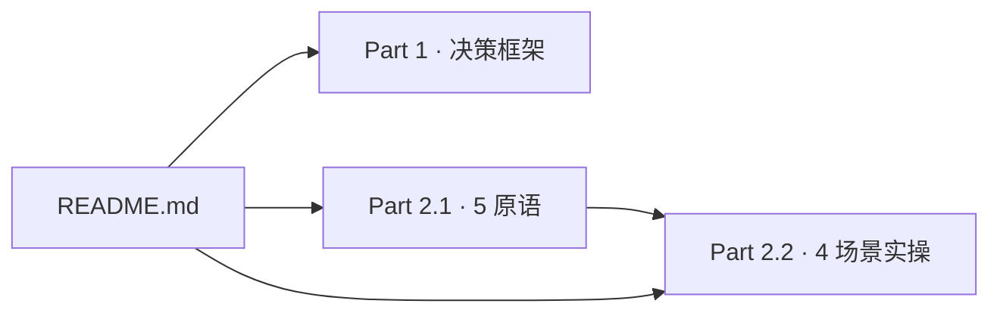

# Agent Quality Guide

> **数据来源**:本文档示例数据来自 2026-09-25 **单日合成拦截日志** + 4 个源项目 examples(rime-claude / cut-ad / sandbox-verify / media-to-doc-ui),**非全年生产统计**。其中 media-to-doc-ui 因路径不可访问,仅有 examples 描述性证据,无 JSONL 拦截计数。
>
> 142 次拦截分布见 `_data-extract-notes.md` §1(media-to-doc-ui 标 N/A)。

## 1. What is this?

loop-engineering 项目的**质量提升手册**。讲**装好 loop-engineering 之后,如何用它提高 agent 执行任务的质量** —— 5 hook 怎么挡危险命令、LoopX 5 原语怎么落地、Playbook A/B/C 怎么用、出了问题怎么调。

本指南是**纯文档,不改代码**。所有 hook / skill / command / playbook 都已在 `hooks/` `templates/` `playbooks/` 中实现,这里只讲"为什么用、怎么用、什么时候用"。

## 2. 谁该读

| 读者 | 时间 | 推荐路径 |
|---|---|---|
| **决策者**(是否引入 loop-engineering) | 10 min | README → [Part 1](PART-1-DECISION-FRAMEWORK.md) |
| **使用者**(刚装好想用起来) | 60 min | README → [Part 2.1](PART-2-1-PRIMITIVES.md) → [Part 2.2](PART-2-2-SCENARIOS.md) |
| **深度使用者**(已用半年,想调优/解 bug) | 按需 | [Part 2.3](PART-2-3-ASSETS.md) + [Part 3](PART-3-TUNING-FAQ.md) |

## 3. 阅读路径

3 条核心路径(来自 spec §4):

1. **决策者 10 min**:`README → Part 1`(ROI + 适用场景 + 风险,看完拍板)
2. **使用者 60 min 入门**:`README → Part 2.1 → Part 2.2`(理论 → 4 场景实操)
3. **深度使用者深度使用**:`Part 2.3` + `Part 3`(按需跳读,查 hook 配置 / 翻 FAQ)

## 4. 版本与更新

- **最后更新日期**:2026-09-26
- **数据截止**:2026-09-25 单日合成拦截日志(详见 `_data-extract-notes.md`)
- **版本同步**:跟 loop-engineering v1.x 同步,大版本变更时整本重写
- **失效信息反馈**:文档过时 / 链接断裂 / 案例错漏 → [GitHub issue](https://github.com/kizemo/loop-engineering/issues)

## 5. 关联文档

- [Part 1 · 决策框架](PART-1-DECISION-FRAMEWORK.md) — ROI / 适用场景 / 迁移成本 / 风险
- [Part 2.1 · 5 原语理论](PART-2-1-PRIMITIVES.md) — Objective / Todo / Gate / Evidence / Quota
- [Part 2.2 · 4 场景实操](PART-2-2-SCENARIOS.md) ← **主菜** — 日常开发 / PR review / 跨天调研 / 应急响应
- [Part 2.3 · 资产速查](PART-2-3-ASSETS.md) — 5 hook + 3 skill + 1 cmd + 3 Playbook
- [Part 3 · 调优 FAQ](PART-3-TUNING-FAQ.md) — 误拦截 / 调 hook / 升级指南
- 跨链:[根 README](../../README.md) · [Playbooks](../../playbooks/README.md)
